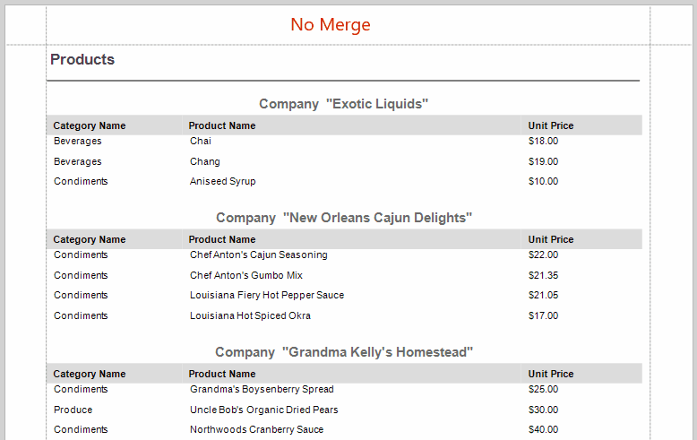

<!-- default badges list -->

<!-- default badges end -->
# Reporting for WinForms - How to Vertically Merge Cells With Duplicate Values

This example shows how to merge table cells with the same values vertically.

In this example, the adjacent cells in the **Products** column with the same values are merged.

The resulting report looks as follows:

In the report code, the [ProcessDuplicatesMode](https://docs.devexpress.com/XtraReports/DevExpress.XtraReports.UI.XRControl.ProcessDuplicatesMode) property is set to `Merge`. The application allows you to set the [ProcessDuplicatesTarget](https://docs.devexpress.com/XtraReports/DevExpress.XtraReports.UI.XRControl.ProcessDuplicatesTarget) property to `Value` to merge cells with identical data field values, or to `Tag` to merge cells with the identical [Tag](https://docs.devexpress.com/XtraReports/DevExpress.XtraReports.UI.XRControl.Tag) property content.

## Files to Look At

- [Form1.cs](CS/ProcessDuplicatesTarget/Form1.cs) (VB: [Form1.vb](VB/ProcessDuplicatesTarget/Form1.vb))
- [ProductReport.cs](CS/ProcessDuplicatesTarget/ProductReport.cs) (VB: [ProductReport.vb](VB/ProcessDuplicatesTarget/ProductReport.vb))

## Documentation

- [Arrange Dynamic Report Contents](https://docs.devexpress.com/XtraReports/5170/detailed-guide-to-devexpress-reporting/arrange-dynamic-report-contents)
- [Use Tables](https://docs.devexpress.com/XtraReports/9741/detailed-guide-to-devexpress-reporting/use-report-controls/use-tables)

## More Examples

- [How to Group Report Data by Days of the Week](https://github.com/DevExpress-Examples/reporting-group-by-days-of-week)
<!-- feedback -->
## Does this example address your development requirements/objectives?

 

(you will be redirected to DevExpress.com to submit your response)
<!-- feedback end -->
